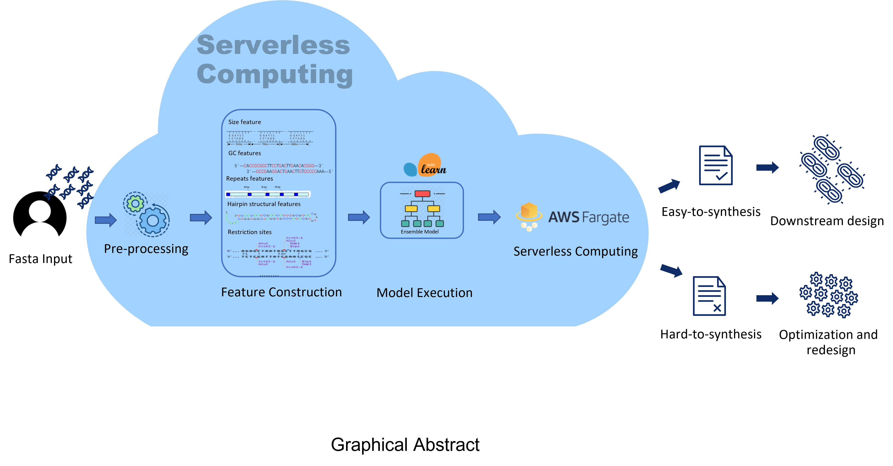

code of the paper 'SCP4SSD: a Serverless Cloud Platform for the prediction of nucleotide Sequence Synthesis Difficulty'
<h1 align="center">
  <a href="#"></a>
  <br>
    DNA Synthesis Difficulty Prediction
  <br>
</h1>
<h3 align="center">A web-based serverless application predicts DNA synthesis difficulty of any given nucleotide sequences.</h3>
<p align="center">
  
  
</p>
<p align="center">
  <a href="#introduction">Introduction</a> •
  <!-- <a href="#requirements">Requirements</a>  • -->
  <a href="#installation">Installation</a> •
  <a href="#usage & example">Usage & Example</a>               •
  <a href="#how-it-works">How it Works</a> •
  <a href="#cite us">Thanks ❤</a>
</p>

## Introduction
This project is inspired from a [research paper](https://pubs.acs.org/doi/abs/10.1021/acssynbio.9b00460). And based on their work, we 1) explore more nucleotide sequence features (from 38 --> 426) 2) train a more powerful model (from single RF ---> ensemble learning) 3) adopt more complex feature selection methods (from random selection ---> GA, variance, correlation methods)

## Installation

1. Clone the repo

```shell
git clone https://github.com/JustinDoIt/scp4ssd.git
cd scp4ssd
```

2. Create Anaconda Environment

```shell
conda env create -f name.yml
```

3. Activate the environment

```shell
conda activate scp4ssd
```

## Usage & Example

```shell
python predict.py --fasta ./examples/example.fna --out ./examples/example_out.csv
```

## Cite us

If this repo help you, happy to cite our paper (coming soon...)

## License

Distributed under the MIT License. See LICENSE for more information
